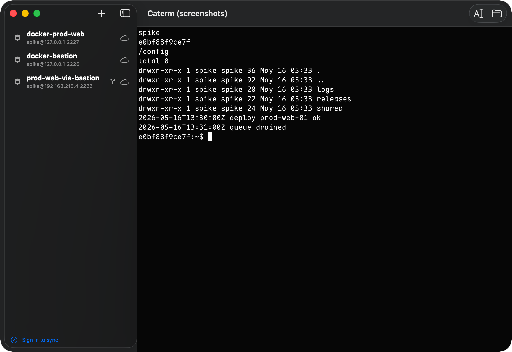
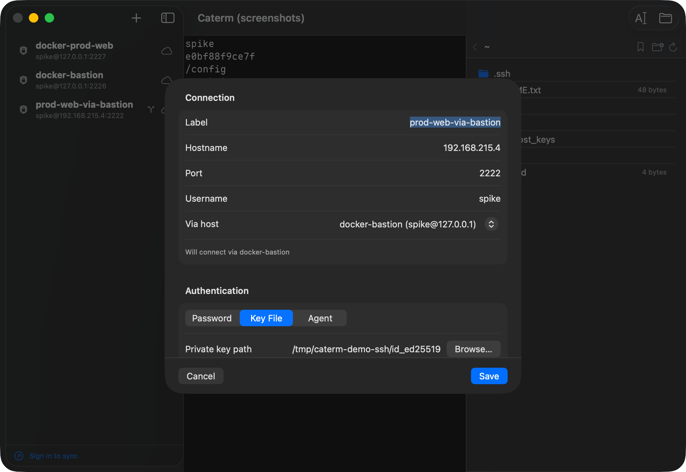
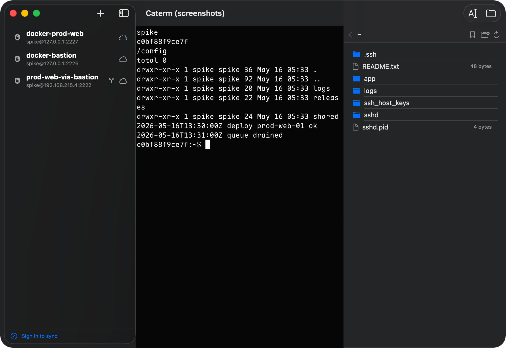
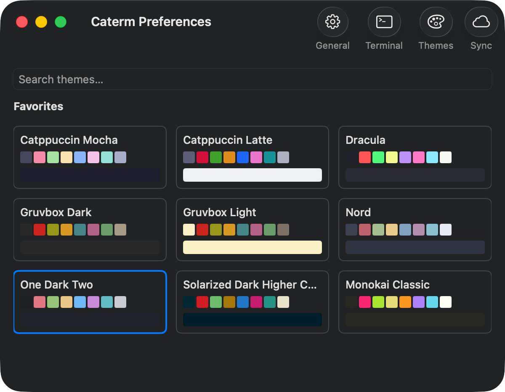
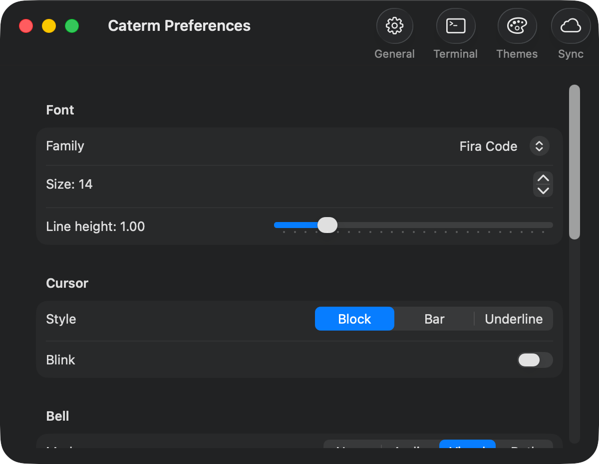
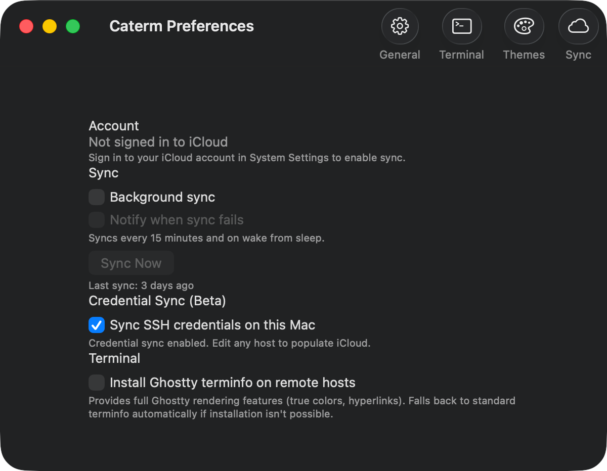

# Caterm

**English** | [简体中文](README.zh-CN.md)

A native macOS SSH terminal manager with iCloud sync and no self-hosted server.

[](https://github.com/ZingerLittleBee/Caterm/releases/latest)

Caterm is a SwiftUI app built on [libghostty](https://github.com/ghostty-org/ghostty)
for the terminal engine. Hosts, credentials, settings, and snippets sync
across your Macs over iCloud — credentials are end-to-end encrypted and never
leave your devices in the clear. There is no account to create and no backend
to run.

## Download

[Download the latest release](https://github.com/ZingerLittleBee/Caterm/releases/latest).
The app is Developer ID signed, notarized, and stapled. Grab
`Caterm-<version>.dmg`, open it, and drag Caterm to Applications.

Requires **macOS 14.0 or later**.

Sync needs the Mac to be signed into iCloud — there is no separate account.
Signed out, Caterm still works fully as a local-only terminal manager; it
just doesn't sync. No degraded mode, no nag screens.

## Screenshots



| Host chaining | SFTP drawer | Themes |
|---|---|---|
|  |  |  |

| Terminal settings | iCloud sync |
|---|---|
|  |  |

## Features

### Terminal

- Ghostty-powered terminal surfaces with tabbed sessions and a collapsible
  host-list sidebar (`⌘B` to toggle).
- Bundled `xterm-ghostty` terminfo with opt-in remote install per host.
- Full terminal settings UI (font, cursor, colors, behavior) backed by a
  managed Ghostty config snapshot with diagnostic surfacing.
- Theme catalog extracted from Ghostty with a searchable picker, favorites
  grid, and per-host theme overrides.

### SSH

- Host CRUD with optional labels (falls back to `user@host`).
- Host chaining via `ProxyJump`, with a Via-host picker, chain preview,
  cycle detection, and per-session `ssh_config` generation.
- Port forwarding (local/remote/dynamic) per host.
- ControlMaster connection multiplexing with deterministic teardown.
- Chain-aware askpass for credential prompts across hops.

### SFTP

- File transfer drawer with a transfer queue.
- Persisted remote-path bookmarks per host.

### iCloud sync (serverless)

- Host sync via the CloudKit private database with incremental change
  tokens and a force-full safety net.
- End-to-end encrypted credential sync: AES-256-GCM blobs sealed under a
  master key in the synchronizable iCloud Keychain — ciphertext-only to
  Apple.
- Settings sync via `NSUbiquitousKeyValueStore` with revision-based
  last-writer-wins and quarantine on corrupt/incompatible blobs.
- Snippet store and sync.

## Security

Caterm syncs SSH credentials, so the encryption model is deliberate:

- **Credentials are end-to-end encrypted.** Each credential field is sealed
  with **AES-256-GCM** (authenticated with associated data binding it to its
  host, field, and revision) before it ever leaves the device.
- **The master key lives only in your iCloud Keychain.** It is a 256-bit
  symmetric key stored as a *synchronizable* Keychain item, so it
  propagates between your Macs through Apple's end-to-end-encrypted iCloud
  Keychain — Apple cannot read it.
- **Different data, different paths.** Sealed credential blobs ride on
  CloudKit `Host` records; the master key rides iCloud Keychain. Apple sees
  only ciphertext on the CloudKit side and never holds the key to it.
- **Settings** sync via `NSUbiquitousKeyValueStore` and are not sensitive;
  a corrupt or schema-incompatible blob is quarantined rather than applied.
- **Losing a device** does not expose credentials: the blobs are useless
  without the master key, which is gated by your Apple ID and the iCloud
  Keychain security code. Revoke a lost Mac from Apple ID device management
  as usual.

There is no Caterm server and no Caterm account — nothing to breach on our
side because there is no "our side".

## Build from source

### Prerequisites

- macOS 14.0+ with the Xcode command-line tools (Swift 5.10+).
- Homebrew [`zig@0.15`](https://formulae.brew.sh/formula/zig@0.15) — required
  to build libghostty. Expected at `/opt/homebrew/opt/zig@0.15/bin/zig`.

### Steps

```bash
git clone https://github.com/ZingerLittleBee/Caterm.git
cd Caterm

# Init the Ghostty submodule and build Frameworks/GhosttyKit.xcframework
make ghostty-kit

make run-app          # build + codesign + wrap in Caterm.app + launch
```

`make run-app` is the default dev loop — the bare binary crashes on launch
because the app registers for APS push, which requires a bundle identity.

## Development

```bash
make test             # swift test
make build            # swift build (debug)
make doctor           # toolchain / signing diagnostics
make help             # list all targets
```

Codesigning for local development resolves an identity from
`CATERM_DEV_IDENTITY`, `.dev-identity`, or the login keychain.
See [`docs/macos-dev-signing.md`](docs/macos-dev-signing.md) for the signing
pitfalls and the full rationale.

### Debugging

```bash
make run-app          # build + codesign + wrap in Caterm.app + launch (foreground)
make run-bg           # same, but background; stdout/stderr -> /tmp/caterm.log
make kill             # kill the running dev process

tail -f /tmp/caterm.log               # follow logs from `make run-bg`
log stream --predicate 'subsystem == "com.caterm.app"' --level debug  # os_log
```

Always use `make run-app` / `make run-bg`, not the bare binary (`make run`):
the app calls `NSApp.registerForRemoteNotifications()` on launch, which
requires a bundle identity — the bare binary crashes there.

To step through with a debugger, attach LLDB to the debug build:

```bash
make build
lldb .build/debug/caterm           # (lldb) run
# or attach to an already-running instance:
lldb -p "$(pgrep -nf .build/debug/caterm)"
```

Runtime logging goes through `os_log` under subsystem `com.caterm.app`
(filter by category in Console.app — e.g. `cloudkit-sync`,
`snippet-sync`, `signing-diag`).

## Release

### One-time setup (maintainers)

Building a distributable, notarized release requires your own Apple
Developer account. All identity and credentials live outside git in the
gitignored `sign/` directory — nothing personal is committed.

1. A **Developer ID Application** certificate for your team in the login
   keychain.
2. A **Distribution provisioning profile** (Developer ID type) for your
   App ID, configured with `aps-environment=production` and
   `icloud-container-environment=Production`. Save it as
   `sign/Caterm_Developer_ID.provisionprofile` — `release.sh`
   auto-resolves it there.
3. A **notarytool keychain profile** named `caterm` (the app-specific
   password is prompted securely; never commit it):

   ```bash
   xcrun notarytool store-credentials caterm \
       --apple-id <your-apple-id> --team-id <your-team-id>
   ```

4. The **CloudKit schema deployed to Production** once via the CloudKit
   Console (Schema → Deploy to Production) for your iCloud container.

`make doctor` prints the resolved signing diagnostics if anything is off.

### Per release

```bash
# 1. Add a new version section (with date) at the top of the CHANGELOG.
$EDITOR CHANGELOG.md

# 2. Build + Developer ID sign + notarize + staple + dmg.
make release
#    make release ARGS=--skip-notary   signed-only (smoke on your own Macs)
#    make release ARGS=--skip-dmg      .app only, no disk image

# 3. Tag + GitHub release + upload the .dmg and zipped .app.
make publish
#    make publish ARGS=--dry-run       print every action, mutate nothing
#    make publish ARGS=--draft         create the release as a draft
```

`make release` ([`Scripts/release.sh`](Scripts/release.sh))
auto-resolves the Developer ID identity, provisioning profile, and notary
profile, then runs build → distribution codesign (two-pass entitlement
re-seal + askpass entitlement isolation) → bundle assembly → notarize →
staple → dmg → Gatekeeper assessment.

`make publish` ([`Scripts/publish-release.sh`](Scripts/publish-release.sh))
is Gatekeeper-gated — it refuses to publish a build that is not notarized
and stapled — pushes an annotated `v<version>` tag, and creates the
GitHub release with notes pulled from the matching
[`CHANGELOG.md`](CHANGELOG.md) section. The CHANGELOG
version drives the tag, so it must point at the commit you intend to
release (clean tree, pushed to `origin/main`).

## Architecture

A Swift Package Manager project (`Package.swift`) split into
focused modules — terminal engine, SSH command builder, session store,
CloudKit/credential/settings sync clients, SFTP, and the SwiftUI app
target. There is no backend service: all sync flows through the user's
private CloudKit database and iCloud Keychain.

## Acknowledgements

Caterm's terminal is powered by [Ghostty](https://github.com/ghostty-org/ghostty)
(libghostty), vendored as a submodule and built into `GhosttyKit.xcframework`.
Ghostty is MIT-licensed; thanks to Mitchell Hashimoto and the Ghostty
contributors.

## License

[MIT](LICENSE) © ZingerLittleBee. The bundled libghostty is MIT-licensed
and remains under its own terms.
